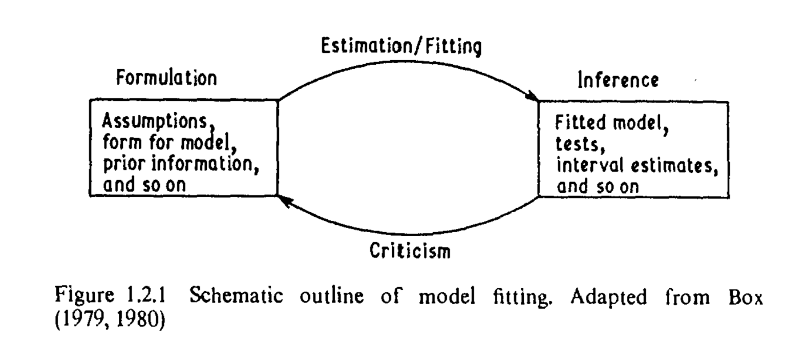
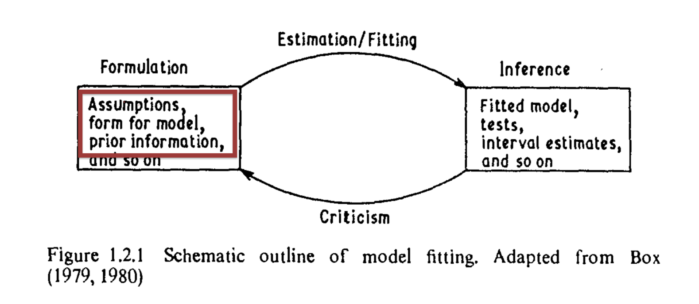
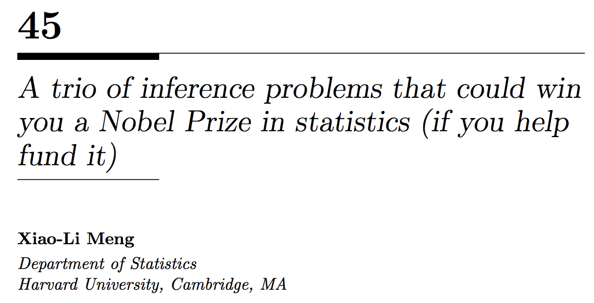

```{r options, include = FALSE}
knitr::opts_chunk$set(echo = FALSE, comment = NA, fig.align = "center", out.width = "100%", knitr.graphics.auto_pdf = TRUE)
```

# Model criticism - 1

```{r old_modelling}

```
- From @cook:weisberg:82, but really from Box [-@box:79;-@box:80] 

# Model criticism - 2

```{r old_modelling_two}

```
- From @cook:weisberg:82, but really from Box [-@box:79;-@box:80] 
- Non-linear increase in difficulty when $\textcolor{myredhighlight}{n, p \to \infty}$

# A complex applied analysis

```{r dani_paper}
knitr::include_graphics("figures/2014_Presanis_melding-h1n1-example.pdf")
```

- 5 sources of data, each idiosyncratic.
    - Some known to be biased in particular directions
    - Different levels of aggregation, national / hospital specific data
- Specifying and critiquing a joint model for all of this?
- Will return to a simplified version 

# Statistical modelling

\input{tex-input/0010-tikz-iteration.tex}

# Statistical submodelling

\input{tex-input/0020-tikz-iteration.tex}

# Melding based statistical modelling?

\input{tex-input/0030-tikz-iteration.tex}

# _Specification_: Markov melding

- Markov melding [@goudie:etal:18] is a method for joining models with common component: $\phi$
- Ideally we would specify the generative model (For $M = 2$ submodels):
\input{tex-input/0040-melding-conditionals.tex}
- Submodels developed in isolation, re-express as:
\input{tex-input/0050-melding-joint.tex}
- Analytic form of $\textcolor{myredhighlight}{\pd_{\modelindex}(\phi)}$ often unknown
    - Can cause numerical issues in the model fitting process
    - Requires accurate estimation in low probability regions  
        - We will revisit

# _Specification_:  Notes on the pooled prior

$\ppoolphi$ addresses two issues:

1. Necessary because we have two priors for $\phi$ [@poole:raftery:00]
\vspace{0.5cm}
2. $\ppoolphi$ should be appropriate for $\phi$ under the melded model _and_ both submodels 
    - Suggests defining $\ppoolphi = g(\pd_{1}(\phi), \pd_{2}(\phi))$
    - Similar problem encountered when experts encode their opinions as priors [@ohagan:etal:06]
        - $\textcolor{myredhighlight}{\textbf{Log}}$: $\ppoolphi = \pd_{1}(\phi)^{w_{1}} \pd_{2}(\phi)^{w_{2}}$
        - Linear: $\ppoolphi = {w_{1}}\pd_{1}(\phi) + {w_{2}}\pd_{2}(\phi)$
        \vspace{0.25cm}
        - Product-of-experts: $\ppoolphi = \pd_{1}(\phi) \pd_{2}(\phi)$ [@hinton:02]
        - Dictatorial: $\ppoolphi = \pd_{\modelindex}(\phi)$ for an $\modelindex \in \{1, 2\}$

# _Estimation_: Multi-stage sampler

- Need to sample the melded posterior:
\input{tex-input/0060-melded-posterior.tex}
- Submodels can be complex $\rightarrow$ sample in stages
    - Multi-stage sampling & approximations are common in practice
    - Staged sampling targets components of $\pd_{\text{meld}}(\phi, \psi_{1}, \psi_{2} \mid Y_{1}, Y_{2})$ in a cumulative manner
    - Can reuse other implementations of $\pd_{m}(\phi, \psi_{\modelindex}, Y_{\modelindex})$
    - Potentially more efficient

# _Estimation_: Stage one acceptance probability

<!-- Bold the stage one bits from the joint -->
- Say we choose to target, $\pd_{\text{meld}, 1}(\phi, \psi_{1} \mid Y_{1})$:
\input{tex-input/0070-stage-one-target.tex}
- Given our stage one target, the stage one sampler has the following acceptance probability:
\input{tex-input/0071-stage-one-acceptance.tex}
<!-- - Typical MH:Can use any transition kernel -->
- (asymptotically) Produces samples from the stage one target

# _Estimation_: Stage two acceptance probability

- Stage two target, the melded posterior:
\input{tex-input/0080-stage-two-target.tex}
- Use stage one samples of $\phi, \psi_{1}$ as the proposal distribution in a Metropolis-within-Gibbs update for $\phi, \psi_{1} \mid \psi_{2}$:
\input{tex-input/0081-stage-two-acceptance.tex}
- Stage one terms cancel:
\input{tex-input/0082-stage-two-acceptance-simplified.tex}
- Generic Metropolis-Hastings update for $\psi_{2} \mid \phi, \psi_{1}$
<!-- - $\pd_{2}(\phi)$ not known analytically $\rightarrow$ substitute KDE: $\hat{\pd}_{2}(\phi)$ -->


# _Example_:  Simplified version of Presanis et. al. (2014) 

- We will now consider a simplified version of Presanis et. al. (2014)
- Submodel details are not overly important for our purpose
- Consider 2 submodels:
    1. Models number of patients in the ICU with H1N1
    1. Collapses the other 4 data sources into an informative prior structure

# _Example_: Submodel 1 - ICU submodel

\input{tex-input/0091-tikz-model-1.tex}

- Notation: $\psi_{1} = (\theta, \pi^{\text{pos}})$
- $\pd_{1}(\theta, Y)$ is a thinned Poisson process as an observational model for $Y$
    - Can derive total number of people in ICU with influenza
- $\pi^{\text{pos}}$ derived from virological data
    - Informs the proportion of people with influenza who are positive for H1N1
- Submodel deterministically defines $\phi = f(\theta, \pi^{\text{pos}})$.

<!-- # Submodel 1 - DAG -->

# _Example_: Submodel 2 - Simplified severity model

\input{tex-input/0092-tikz-model-2.tex}

- Notation: $\psi_{2} = (\chi, \pi^{\text{det}})$
- $\phi \sim \text{Bin}(\chi, \pi_{\text{det}})$ to account for known underestimation of $\phi$
- Informative prior for $\chi$ summarises other components of severity model

# _Example_: Multi-stage sampler - in DAG form  

\input{tex-input/0093-tikz-model-3.tex}

- After stage 2 ($s_{2}$), every node's distribution incorporates information from $Y_{1}$ and $\chi$. 

# _Issue 1_: Things don't always work!

\input{tex-input/0100-stage-two-acceptance-simplified-kde.tex}
```{r conflict_dists, out.width = "85%"}
knitr::include_graphics("figures/conflict.pdf")
```

# _Issue 1_: KDE error in action

\input{tex-input/0100-stage-two-acceptance-simplified-kde.tex}
```{r bad_traces}
knitr::include_graphics("figures/stage-two-trace-presentation-one.png")
```

# _Method 1_: Self density ratios

We only interact with unknown marginal via self-density ratio [@hiraoka:hamada:hori:18]:
  \input{tex-input/0110-self-density-ratio-definition.tex}

_Weighted-sample self-density ratio estimation_ (WSRE) [@manderson:goudie:20] Intuition:

- Sampling $\phi \sim \pd(\phi, \psi, Y)$ admits $\phi \sim \pd(\phi)$ 
- Instead, sample:   
  $\phi \sim \pd(\phi, \psi, Y) \w(\phi; \xi) \quad \rightarrow \quad \phi \sim \frac{1}{Z}\pd(\phi)\w(\phi; \xi) = \s(\phi)$
- Use the weighted sample density estimator of @jones:91:
  \input{tex-input/0112-jones-kde-def.tex}
- Ratio estimator is then:
  \vspace{-0.35cm}  
  \input{tex-input/0111-ratio-estimator-definition.tex}


# _Method 1_: WSRE intuition - 1

```{r wsre_intutition}
knitr::include_graphics("figures/weighted-dist-plot.pdf")
```

# _Method 1_: WSRE intuition - $\Nw$

```{r wsre_intutition_many}
knitr::include_graphics("figures/weighted-dist-plot-many.pdf")
```

# _Method 1_: H1N1 example - 2

\input{tex-input/0140-stage-two-acceptance-simplified-wsre.tex}
```{r good_traces}
knitr::include_graphics("figures/stage-two-trace-presentation-two.png")
```

# _Issue 2_: Submodel conflict

```{r conflict}
knitr::include_graphics("figures/subpost-disagreement.pdf")
```

- Last issue arose (primarily) due to differences in scale
- What about more general model conflict?
    - There is a philosophical issue here
- _Partial solution_: Automatic, multiple importance sampling [@paananen:etal:19]

# _Issue 3_: Multiple $\phi$?

\input{tex-input/0011-example-model-graph.tex}


<!-- # This relates to ICU EHR data ?
 -->
<!-- # Future plans

- Markov melding for ICU delirium, using electronic health record data
    - Observational data (Temperature, respiratory rate)
    - Blood test data
    - Daily ICU drug dose data
    - Each source is idiosyncratic $\rightarrow$ requires substantial modelling effort (and domain expertise)
- Melding for multiple $\phi$: $\pd_{1}(\phi_{1}, Y_{1}) \,\,\,\, \pd_{2}(\phi_{1}, \phi_{2}, Y_{2}) \,\,\,\, \pd_{3}(\phi_{2}, Y_{3})$
- Addressing other kinds of internal difference in scale and location (conflict) -->

# Conclusion

```{r xiao_li}

```
- Multi-source inference is extremely difficult in practice [@meng:14] (along with multi-resolution and multi-phase) 

# Links

Should you also wish to estimate self-density ratios:
  
- https://github.com/hhau/wsre

The traceplots are from this example:

-  https://github.com/hhau/full-melding-example

This talk:
  
-  #TODO: Push this branch to github / link to it

# References {.allowframebreaks}