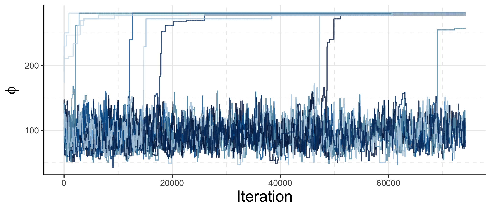
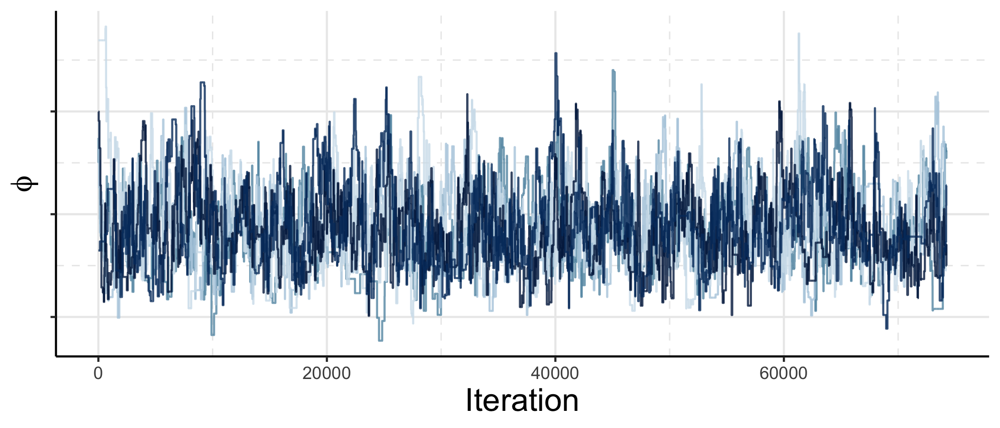

```{r options, include = FALSE}
knitr::opts_chunk$set(echo = FALSE, comment = NA, fig.align = "center", out.width = "90%", knitr.graphics.auto_pdf = TRUE)
```

# Statistical modelling

\input{tex-input/0010-tikz-iteration.tex}

# Modern statistical modelling

\input{tex-input/0020-tikz-iteration.tex}

# Melding based statistical modelling?

\input{tex-input/0030-tikz-iteration.tex}

# Markov melding

- Markov melding [@goudie:etal:18] lets us join models with common component: $\phi$
- Ideally we would specify the generative model (For $M = 2$ submodels):
\input{tex-input/0040-melding-conditionals.tex}
- Models developed in isolation, re-express as:
\input{tex-input/0050-melding-joint.tex}
- Analytic form of $\pd_{\modelindex}(\phi)$ often unknown

# Multi-stage sampler

- Need to sample the melded posterior:
\input{tex-input/0060-melded-posterior.tex}
- Submodels can be complex $\rightarrow$ Sample in stages

# Stage one acceptance probability

<!-- Bold the stage one bits from the joint -->
- Say we we choose to target:
\input{tex-input/0070-stage-one-target.tex}
- Given our stage one target, the stage one sampler has the following acceptance probability:
\input{tex-input/0071-stage-one-acceptance.tex}
<!-- - Typical MH:Can use any transition kernel -->
- (asymptotically) Produces samples from the stage one target

# Stage two acceptance probability

- Stage two target, the melded posterior:
\input{tex-input/0080-stage-two-target.tex}
- Use stage one samples of $\phi$ as the proposal distribution in a Gibbs update for $\phi \mid \psi$:
\input{tex-input/0081-stage-two-acceptance.tex}
- Stage one terms cancel:
\input{tex-input/0082-stage-two-acceptance-simplified.tex}
- $\pd_{2}(\phi)$ not known analytically $\rightarrow$ substitute KDE: $\hat{\pd}_{2}(\phi)$


<!-- - We then use these stage one samples as a proposal for stage two, as this results in a cancellation in the acceptance probability:
- However, there is a subtle issue here, we typically do not know the prior marginal distributions for the common parameter
- The usual solution is to sample the marginal and compute a KDE -->

<!-- # Conflict?

- if the stages disagree about the distribution of the common component, the following can occur.
  - Stage one samples are much wider / different located than the stage-two model's prior
  - This means we evaluate the KDE at points for which we know it is a poor estimate (small probabilities of samples being in that neighbourhood)
  - Hence{, the stage two acceptance probability is dominated by this error}
 -->
# Conflict
\input{tex-input/0100-stage-two-acceptance-simplified-kde.tex}
```{r conflict_dists}
knitr::include_graphics("figures/conflict.pdf")
```

# Conflict in action

\input{tex-input/0100-stage-two-acceptance-simplified-kde.tex}
```{r bad_traces}

```
- H1N1 example from @goudie:etal:18
<!-- Need the acceptance probability in here -->

# Self density ratios

<!-- cite Hiraoka? -->
<!-- Maths on this slide -->

- Only interact with unknown marginal via self-density ratio [@hiraoka:hamada:hori:18]:
  \input{tex-input/0110-self-density-ratio-definition.tex}

- _Weighted-sample self-density ratio estimation_ (WSRE) Intuition:
    - Sampling $\phi \sim \pd(\phi, \psi, Y)$ admits $\phi \sim \pd(\phi)$ 
    - Instead, sample: $\phi \sim \pd(\phi, \psi, Y) \w(\phi; \eta) \,\, \rightarrow \,\, \phi \sim \pd(\phi)\w(\phi; \eta) = \s(\phi)$
    - Use the weighted sample density estimator of @jones:91:
        
        \input{tex-input/0112-jones-kde-def.tex}

    - Ratio estimator is then:

        \input{tex-input/0111-ratio-estimator-definition.tex}

# WSRE intuition - 1

```{r wsre_intutition}
knitr::include_graphics("figures/weighted-dist-plot.pdf")
```

# WSRE intuition - $\Nw$

```{r wsre_intutition_many}
knitr::include_graphics("figures/weighted-dist-plot-many.pdf")
```

<!-- second picture with points -->
# Fixed!
\input{tex-input/0140-stage-two-acceptance-simplified-wsre.tex}
```{r good_traces}

```

<!-- Acceptance probability -->

<!-- whole thing -->

# References